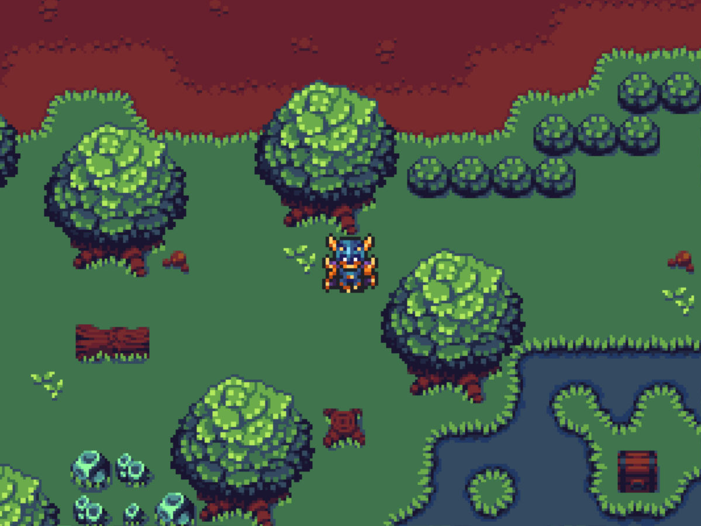
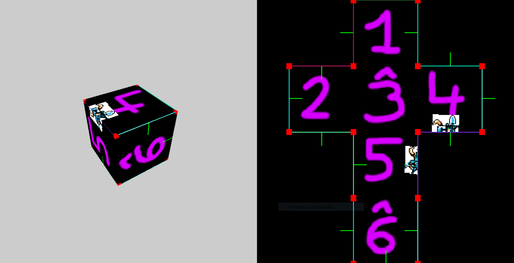
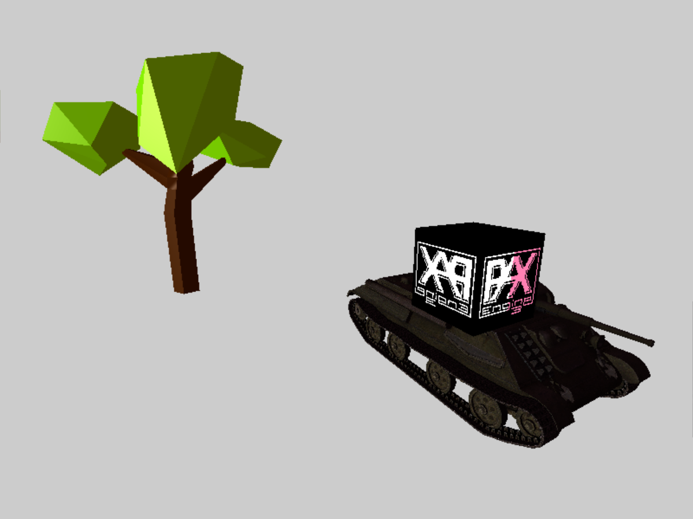

PaxEngine3 is a game engine centered about designing an extensible, transparent, and intuitive API.
Finding easy but sufficiently expressive ways for creating your game is the central motivation of this project.
It does not provide sophisticated graphics yet but allows to integrate those at any time.
Below you can find screenshots from three demo projects.
The assets in these screenshots are custom or from [opengameart.org](opengameart.org) and [itch.io](itch.io).


The [TileDemo][1] is a showcase for importing tile maps created in the [Tiled Map Editor][2].


[Meshfold][3] is a _proof of concept_ for an idea where a two-dimensional game world is modelled as the surfaces of a three-dimensional shape given as a mesh.


[Small demo][5] on rendering 3D meshes imported with the [assimp library][4].

## Architecture

PaxEngine3 is a plugin framework implemented in the libraries `paxcore` and `paxutil`.
The [Engine](include/paxcore/Engine.h) is started with a custom [Game](include/paxcore/Game.h) and a set of [Plugins](include/paxcore/plugin/EnginePlugin.h):

```c++
int PAX::Tile_main(int argc, char *argv[]) {
    int exitcode = 0;

    PAX::TileDemo::Demo game;

    PAX::SDL::SDLPlugin               sdl;
    PAX::OpenGL::OpenGLPlugin         openGL;
    PAX::SDL::OpenGL::SDLOpenGLPlugin sdlOpenGLLink;
    PAX::Tiles::Plugin                tiles;
    PAX::TileDemo::Plugin             demoPlugin;

    PAX::Engine &engine = PAX::Engine::Instance();
    engine.initialize(
            &game,
            {
                    &sdl,
                    &openGL,
                    &sdlOpenGLLink,
                    &tiles,
                    &demoPlugin
            }
    );
    exitcode = engine.run();

    return exitcode;
}
```
This example is taken from the [TileDemo][1], shown in the first screenshot.

Plugins delivered with the engine can be found in the [plugins](plugins) directory and consist of:
- [paxassetimport](plugins/paxassetimport): Importing of 3D assets such as meshes with [assimp][4].
- [paxopengl](plugins/paxopengl): Implementation of rendering in OpenGL.
- [paxsdl](plugins/paxsdl): Implementation of window management via SDL. This plugin also contains the optional second plugin [SDLOpenGLPlugin](plugins/paxsdl/include/paxsdl/opengl/SDLOpenGLPlugin.h) to link SDL against OpenGL.
- [paxphysics](plugins/paxphysics): Implementation of 2D rigid body physics with [Box2D](https://box2d.org/).
- [paxtiles](plugins/paxtiles): Tilemaps and importer for the [Tiled][2] map editor [json format](https://doc.mapeditor.org/en/stable/reference/json-map-format/).
- [games](plugins/games): Directory of several demo games from which the screenshots above are taken.

### paxcore

The central library of PaxEngine3, contains all primary artefacts and interfaces for extending the framework:
- [Engine](include/paxcore/Engine.h): Root object of the entire software containing the game loop.
- [Game](include/paxcore/Game.h): Abstract class that is intended to be derived to setup your game! Manages all active _worlds_.
- [GameEntity](include/paxcore/gameentity/GameEntity.h): Describes game objects in the scene and is implemented as an [Entity](https://github.com/PaulAtTUBS/Polypropylene/blob/master/include/polypropylene/property/Entity.h) of our custom entity-property system [Polypropylene](https://github.com/PaulAtTUBS/Polypropylene).
- [World](include/paxcore/world/World.h): Describes a scene of _GameEntities_ and is implemented as an [Entity](https://github.com/PaulAtTUBS/Polypropylene/blob/master/include/polypropylene/property/Entity.h) of our custom entity-property system [Polypropylene](https://github.com/PaulAtTUBS/Polypropylene).
There can be multiple acitve worlds at the same time to support offline rendering, minimaps, splitscreen, hud among others.
- [GameSystem](include/paxcore/system/GameSystem.h): Interface for arbitrary systems operating on the game's state.
- [io](include/paxcore/io): Contains classes for reading user input.
- [rendering](include/paxcore/rendering): Sub-library with rendering facilities such as constructing scene graphs, camera and viewport management, framebuffers, and asset management.
- [service](include/paxcore/service/Services.h): Centralised management of services such as, io, resource management, allocation, instantiation of implementations for interfaces provided by plugins, window management, and important paths.

[GameEntities](include/paxcore/gameentity/GameEntity.h) and [Worlds](include/paxcore/world/World.h) are implemented as entities of the custom entity-property system [Polypropylene](https://github.com/PaulAtTUBS/Polypropylene).
This allows defining and changing worlds and game objects arbitrarily, flexibly, and serializable.

[1]: plugins/games/TileDemo/src/main.cpp
[2]: https://www.mapeditor.org
[3]: plugins/games/Meshfold/
[4]: http://www.assimp.org/
[5]: plugins/games/PlaygroundDemo/